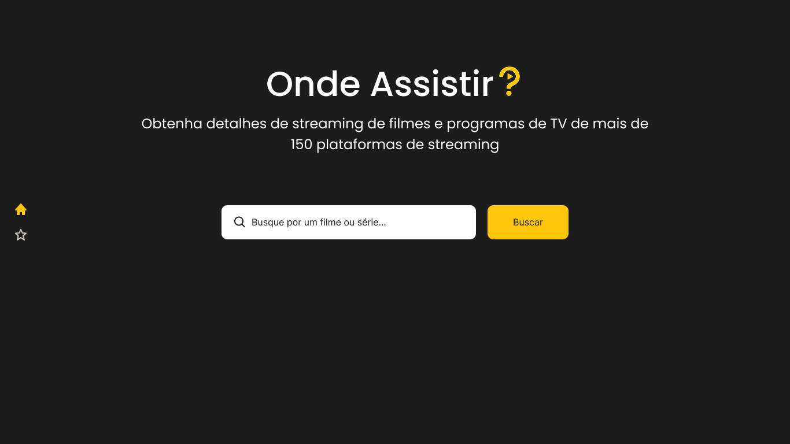
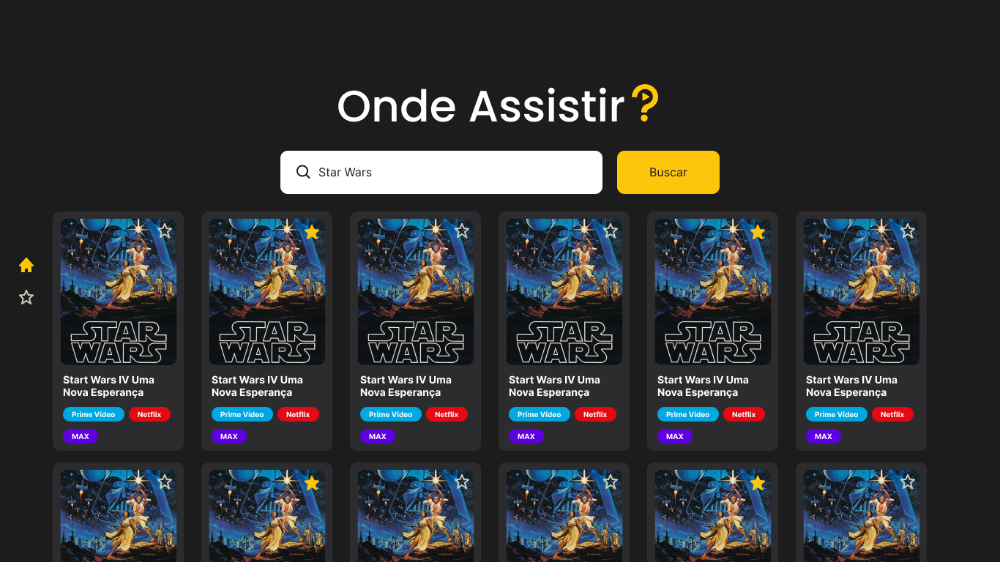

<p align="center">
  
</p>

<h1 align="center">Onde Assistir?</h1>
<p align="center">Encontre onde seu filme preferido está disponível</p>


## Descrição do Projeto
O **Onde Assistir?** é uma aplicação web que permite ao usuário buscar filmes e verificar em quais plataformas de streaming eles estão disponíveis. Além disso, a aplicação permite favoritar filmes para facilitar o acesso posteriormente.

## Prototipação no Figma
- [Link para o protótipo](https://www.figma.com/design/FwzpFKuDEdOR9TTrQvjR9Y/Onde-Assistir----Descubra-onde-seu-filme-favorito-est%C3%A1-dispon%C3%ADvel-para-streaming?node-id=16-2&p=f&t=l92DPJWxpawKfrbL-0)

## Design System
- [Onde Assistir Design System - Framework e Componentes](https://docs.google.com/document/d/1qCcABT_3UhhDR5vTRd9psxvVTJckfkarPOnjVlE0Jq0/edit?usp=sharing)

## Framework CSS
O projeto utiliza o framework [TailwindCSS](https://tailwindcss.com/) junto com a biblioteca [Shadcn](https://ui.shadcn.com/).

## Dependências
- Angular
- TailwindCSS
- Shadcn
- rxjs

## Link para o site em produção
[Em breve](#)

## Checklist de Funcionalidades
- [ ] Campo de busca para filmes  
- [ ] Exibir lista de filmes encontrados  
- [ ] Mostrar plataformas de streaming disponíveis  
- [ ] Favoritar filmes  
- [ ] Responsividade da interface  
- [ ] Conexão com API pública para busca de filmes  
- [ ] Armazenamento local dos favoritos  

## Instruções de Execução
1. Clone este repositório:  
   ```bash
    git clone --depth 1 --no-checkout git@github.com:matheusrc-dev/aplicacoes-frontend.git
    cd aplicacoes-frontend
    git sparse-checkout set onde-assistir
    git checkout
   ```
2. Acesse a pasta do projeto:  
   ```bash
    cd onde-assistir
   ```
3. Instale as dependências:  
   ```bash
   npm install
   ```
4. Inicie o servidor de desenvolvimento:  
   ```bash
   npm start
   ```
5. Acesse no navegador:  
   ```
   http://localhost:4200
   ```

## Telas da Aplicação




## 📖 Checklist | Indicadores de Desempenho (ID) dos Resultados de Aprendizagem (RA)

### RA1 - Prototipar e projetar interfaces gráficas de usuário, considerando princípios de usabilidade e experiência do usuário.
- [ ] **ID1**: Desenvolver protótipos de interfaces que demonstram compreensão das diretrizes de usabilidade.
- [ ] **ID2**: Projetar interfaces responsivas que se adaptam a diferentes tamanhos de tela.

### RA2 - Criar e reutilizar componentes em frameworks frontend, desenvolvendo interfaces modulares, responsivas e estilizadas.
- [ ] **ID3**: Desenvolver componentes reutilizáveis e que se adaptem de maneira responsiva em vários tamanhos de tela.
- [ ] **ID4**: Incorporar componentes de frameworks CSS.
- [ ] **ID5**: Aplicar diretivas estruturais para exibir ou ocultar elementos de forma condicional.
- [ ] **ID6**: Utilizar diretivas estruturais para repetir elementos de interface de maneira dinâmica, a fim de criar listas, galerias ou outras visualizações baseadas em conjuntos de dados.
- [ ] **ID7**: Aplicar Pipes para formatar a apresentação de dados.

### RA3 - Sincronizar dados entre a interface gráfica e o modelo de dados, aplicando técnicas de binding para manter a consistência.
- [ ] **ID8**: Aplicar técnicas de one-way data binding, como Interpolation e Property Binding, para exibir e atualizar dados na interface gráfica de maneira unidirecional.
- [ ] **ID9**: Aplicar técnicas de event binding para capturar eventos do usuário na interface e interagir com o modelo de dados.
- [ ] **ID10**: Aplicar técnicas de two-way data binding para criar uma sincronização bidirecional automática entre a interface e o modelo de dados.
- [ ] **ID11**: Usar variáveis de template para manipulação dinâmica dos dados na interface gráfica.

### RA4 - Implementar comunicação eficaz entre componentes, utilizando padrões de comunicação e serviços para compartilhar lógica e dados.
- [ ] **ID12**: Criar comunicação entre componentes não relacionados hierarquicamente por meio de serviços através do mecanismo de injeção de dependência.
- [ ] **ID13**: Utilizar as diretivas @Input ou @Output para comunicação em uma hierarquia de componentes.

### RA5 - Criar interfaces de navegação intuitivas e responsivas, implementando roteamento em aplicações de página única (SPA).
- [ ] **ID14**: Configurar rotas para diferentes partes da aplicação, permitindo a navegação entre páginas distintas.
- [ ] **ID15**: Passar dados entre componentes que representam diferentes telas usando parâmetros de rotas.
- [ ] **ID16**: Criar uma estrutura de navegação aninhada para representar hierarquias de conteúdo.
- [ ] **ID17**: Aplicar guardas de rotas para controlar o acesso a rotas específicas da aplicação, assegurando que somente usuários autorizados possam acessar determinadas partes da interface.

### RA6 - Realizar requisições assíncronas para serviços web, compreendendo os protocolos e formatos de troca de dados, tratando respostas e erros.
- [ ] **ID18**: Fazer requisições assíncronas a uma API pública para no mínimo a operação GET.
- [ ] **ID19**: Fazer requisições assíncronas a uma API simulada/fake para as operações GET, POST, PUT, PATCH e DELETE.
- [ ] **ID20**: Tratar respostas de sucesso e erros das requisições assíncronas.
- [ ] **ID21**: Aplicar validações de entrada nos campos do formulário, utilizando técnicas como expressões regulares (REGEX), e apresentar mensagens de erro claras e informativas para auxiliar os usuários a corrigir entradas incorretas.
- [ ] **ID22**: Desabilitar adequadamente o botão de submit enquanto o formulário conter campos inválidos, evitando a submissão de dados incorretos.
- [ ] **ID23**: Utilizar Promises para tratar respostas assíncronas.
- [ ] **ID24**: Utilizar Observables para tratar respostas assíncronas.

### RA7 - Gerenciar o código-fonte de maneira eficiente, implementar boas práticas de controle de versão e colaborar em projetos de desenvolvimento.
- [ ] **ID25**: Criar um repositório no GitHub utilizando a estrutura do Gitflow, estabelecendo as branches "main" e "develop".
- [ ] **ID26**: Colaborar com outros membros do projeto, realizando fusões (merges) e resolução de conflitos.
- [ ] **ID27**: Planejar, configurar e executar o processo de build da aplicação, preparando-a para produção e realizar o deploy em um ambiente de hospedagem.